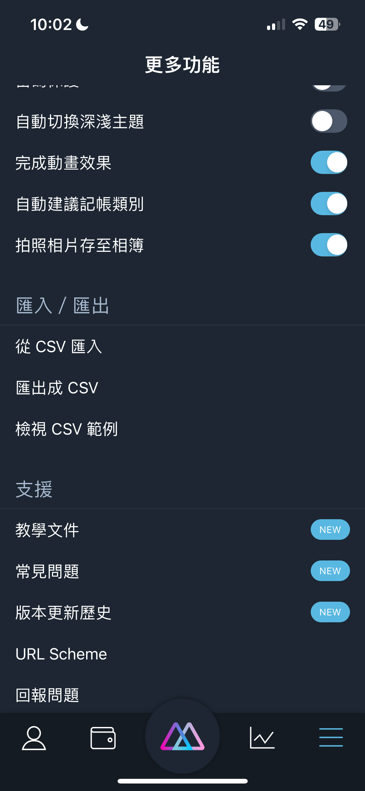
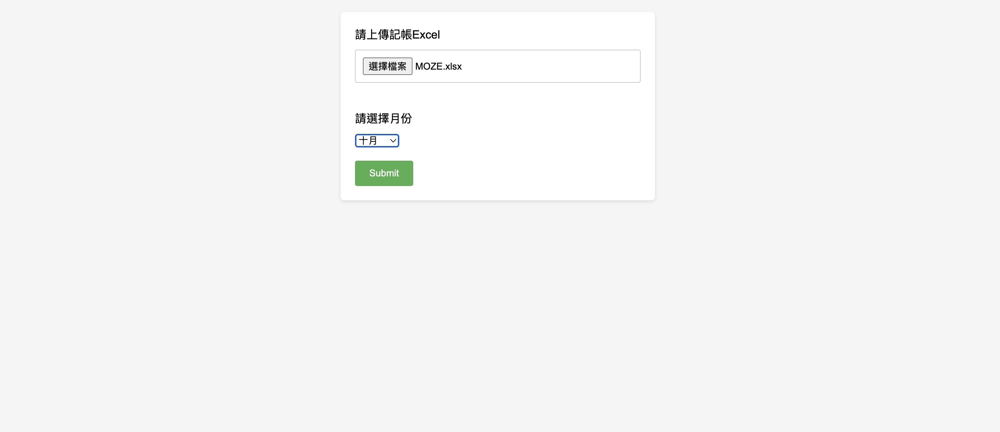
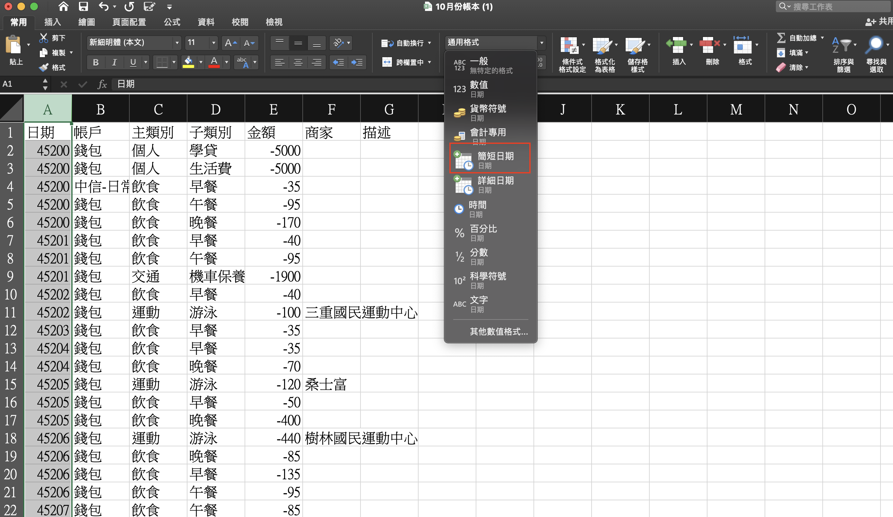
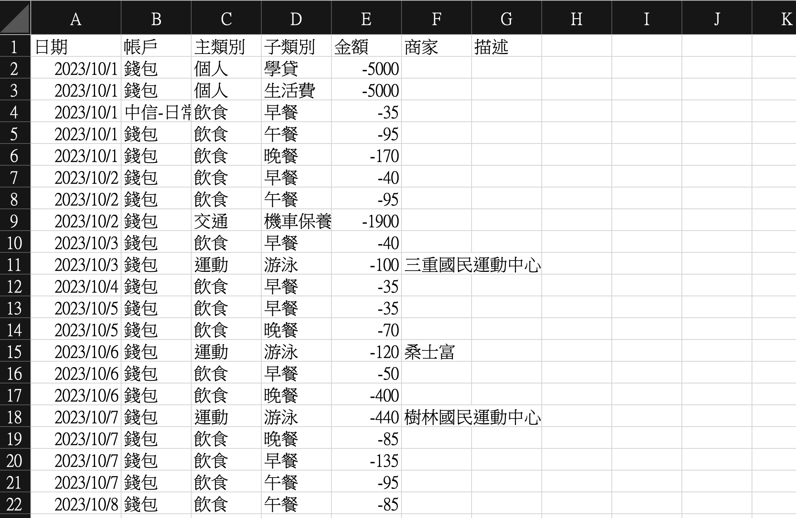

# MOZE 記帳APP Excel 整理
## 描述
根據 MOZE APP 記帳軟體，把匯出的 Excel 做整理，只留下必要的資訊

## 技術
* JDK 17
* SpringBoot 3.1.1

## 使用方法
1. 打開 MOZE 記帳 APP，並且選擇匯出成 CSV 

2. 啟動 SpringBoot
3. 在網頁瀏覽器中訪問應用程式：http://localhost:8083
4. 點擊「選擇檔案」按鈕，選擇要導入的記帳 Excel 檔案
5. 在「月份」下拉選單中，選擇要篩選數據的月份(年份為當前年份）。 

6. 點擊「提交」按鈕開始對 Excel 進行處理
7. 處理完成後，新版的 Excel 會自動下載
8. 打開 Excel 可以發現，只留下我們想要的資訊了，只是日期的格式怪怪的，需要進一步調整
9. 點擊 A 欄，選擇常用 -> 通用格式下拉選單 -> 簡短日期

10. 大功告成，最後可以發現只留下我們需要的欄位（此 Excel 只篩選出支出，不包含收入） 
    
